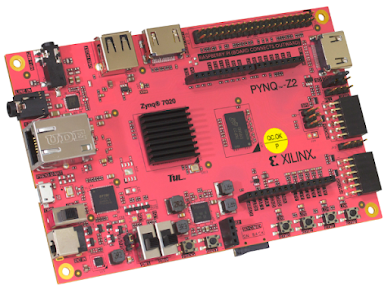

# fpga

Verilog projects for the PYNQ-Z2 (Zynq-7020, `xc7z020clg400-1`), built with
the open-source toolchain instead of Vivado. Synthesis and place-and-route use
Yosys and nextpnr-xilinx via [openXC7](https://github.com/openXC7), wrapped by
[apio](https://github.com/FPGAwars/apio). The board is programmed over the
network from the Linux it boots itself, so no JTAG cable is involved.



## Setup

### Toolchain

apio installs everything with two commands. It runs on Linux and macOS.

```sh
pipx install apio
apio packages install
```

That pulls about 5 GB because it includes databases for every 7-series chip
apio supports. If space is tight, keep only the Zynq-7020 bits; it goes down
to roughly 2 GB:

```sh
cd ~/.apio/packages/openxc7
find chipdb -name '*.bin' ! -name 'xc7z020clg400.bin' -delete
rm -rf share/nextpnr/external/prjxray-db/{artix7,spartan7}
cd ~/.apio/packages/oss-cad-suite
rm -rf libexec/nextpnr-{ice40,machxo2,ecp5,nexus,himbaechel} share/{icebox,trellis,nextpnr}
```

Re-running `apio packages install` restores the full set, so redo the trim
afterwards.

I build on a small Linux server rather than locally. `scripts/remote-build.sh`
rsyncs a project there, runs apio, and copies the `.bit` back. Which server
and which key are set in `scripts/local.env`, which is git-ignored; copy
`scripts/local.env.example` to get started. If apio is installed locally you
can just run `apio build` inside the project directory instead.

### Board

Flash the PYNQ-Z2 image from [pynq.io](http://www.pynq.io/boards.html) to a
microSD card (8 GB or more). Balena Etcher works, or on a Mac:

```sh
diskutil list
diskutil unmountDisk /dev/diskN
sudo dd if=pynq_z2_v3.0.1.img of=/dev/rdiskN bs=4m status=progress
```

Leave the jumpers at their defaults: JP4 (boot) on SD, JP5 (power) on USB.
Micro-USB from the computer is enough to power the board for these projects.

Plug in the card, Ethernet and USB, flip the switch. After about 40 seconds
the green DONE LED and the two blue LEDs come on; that's Linux up with the
default PYNQ overlay loaded. Login is `xilinx` / `xilinx`, over SSH or the
Jupyter server on port 9090. Putting your public key in
`~/.ssh/authorized_keys` on the board saves typing the password.

### Reaching the board

On a normal LAN the board takes a DHCP address and usually answers to
`pynq.local`. With a cable straight into the computer there is no DHCP, and
the board falls back to `192.168.2.99/24`; give your Ethernet adapter an
address in that subnet, e.g. `192.168.2.1`.

Without configuring anything you can also use IPv6 link-local. This lists
everything on the adapter `enX`; the reply that isn't your own machine is the
board, and its MAC starts with `00:05:6b` (Xilinx):

```sh
ping6 -c 2 -I enX ff02::1
ndp -an | grep enX
ssh xilinx@fe80::…%enX
```

`scp` can't handle the `%enX` scope, which is why the load script pipes files
through `ssh 'cat > file'`.

## Workflow

```sh
scripts/remote-build.sh blinky            # -> blinky/_build/blinky.bit
scripts/remote-build.sh blinky test       # iverilog testbench
scripts/remote-build.sh blinky report     # utilisation and Fmax
scripts/load-board.sh blinky/_build/blinky.bit
```

For blinky, the load script prints `state: operating`, LD0 blinks at about
1 Hz, and the board stays reachable over SSH. The FPGA forgets the design when
powered off, and the PYNQ boot loads its base overlay again, so reload after
every reboot.

A new project is a copy of `blinky/`: `apio.ini` names the board and the top
module, `pynq-z2.xdc` holds the pin constraints, `*_tb.v` is the testbench,
and `ps7_stub.v` must stay (see below).

## How loading works

`scripts/load-board.sh` converts the `.bit` with `scripts/bit2bin.py`, which
drops the header and byte-swaps each 32-bit word into the form the Zynq
`fpga_manager` driver wants. The result goes to `/lib/firmware/` on the board,
then

```sh
echo 0 > /sys/class/fpga_manager/fpga0/flags
echo blinky.bin > /sys/class/fpga_manager/fpga0/firmware
```

does the actual programming. `dmesg` shows
`fpga_manager fpga0: writing blinky.bin to Xilinx Zynq FPGA Manager` and
`/sys/class/fpga_manager/fpga0/state` reads `operating`.

I don't use `pynq.Bitstream(...).download()` for this. It lives in a
virtualenv that only login shells activate, it expects Vivado's `.hwh`
metadata, and it does extra XRT work that isn't needed for a plain bitstream.
The sysfs path is two lines and works for openXC7 and Vivado output alike.

## Every design needs a PS7 instance

This one cost a few power cycles. My first bitstream had no processing-system
block. It loaded fine and the LED blinked, but Linux on the board froze the
same instant, every time, whichever way it was loaded.

On Zynq the configuration of the interface between the ARM side (PS) and the
fabric (PL) is stored in the bitstream as the `PS7` cell's settings. Without a
`PS7` instance that interface is left undefined and the cores hang as soon as
the new configuration takes effect. Vivado warns about this; openXC7 doesn't.

`blinky/ps7_stub.v` instantiates `PS7` with every input tied off (AXI clocks
to the PL clock, active-low signals high, the rest low). It was generated from
the port list in Yosys's `cells_xtra.v`. The top module includes it under
`` `ifdef SYNTHESIZE `` so the iverilog testbench, which has no PS7 model,
still runs. With it in place the placement report shows `PS7_PS7: used 1` and
the board stays up after loading.

When a design actually needs the PS (AXI-Lite registers, FCLK clocks,
interrupts), wire those PS7 ports instead of tying them off. The openXC7 demo
`ps7-blinky-digilent-pynqz1` shows an AXI-Lite GPIO on `MAXIGP0`.

## Pinout

All pins are LVCMOS33.

| signal | pins |
| --- | --- |
| 125 MHz clock (from the Ethernet PHY, always present) | H16 |
| LEDs LD0–LD3 | R14 P14 N16 M14 |
| Buttons BTN0–BTN3 | D19 D20 L20 L19 |
| Switches SW0–SW1 | M20 M19 |
| RGB LED LD4 (R G B) | N15 G17 L15 |
| RGB LED LD5 (R G B) | M15 L14 G14 |

Arduino, Pmod and HDMI pins are in the PYNQ-Z2 reference manual and in the
board's `base.xdc` from the PYNQ repository.

## When things go wrong

Board stops answering right after a load but the LED runs: the design has no
`PS7` instance. Power-cycle, add `ps7_stub.v`, rebuild.

`fpga_manager ... failed with error -22`: the `.bin` is empty or not
byte-swapped. It should be about 4 MB and start with `ff ff … bb 00 00 00 44
00 22 11`. One way to get an empty file is `sudo -S sh -c 'cat > f' < f`,
which feeds the password to `cat`; copy as the normal user and `sudo cp`.

`No module named pynq` or `No Devices Found` when running Python over SSH:
you're outside the PYNQ virtualenv or not root. Either use a login shell
(`bash -lc`) or skip PYNQ and use the sysfs path above.

`pynq.local` doesn't resolve: expected on a direct cable, see "Reaching the
board".

## Limits

openXC7 has no block-design editor, no Xilinx IP catalog, rough timing
analysis and only hand-wired PS7 support. That's fine for learning HDL and for
pure-fabric designs (LEDs, buttons, Pmods, HDMI, your own cores). Anything
built around the processing system with Xilinx IP still wants Vivado, which
needs an x86 Linux machine with 16 GB of RAM and well over 60 GB of disk.
Bitstreams from Vivado load with the same `scripts/load-board.sh`.
